# Quillify ✍️

<div align="center">


A modern, full-stack blogging application built with Next.js and JavaScript, powered by MongoDB for database operations.

[Features](#-features) • [Tech Stack](#️-tech-stack) • [Installation](#-installation--running-locally) • [Contributing](#-contributing) •  [Screenshots](#-screenshots) • [Live](#-live) • [Author](#-author)

</div>

## ✨ Features

- **🔐 Secure Authentication** - Login and registration with JWT and bcryptjs
- **📝 Rich Text Editing** - Create and edit posts with WYSIWYG editor
- **📱 Responsive Design** - Fully adaptive across all devices
- **📅 Smart Date Formatting** - Intuitive published date displays
- **🔔 Real-time Notifications** - Toast notifications for user interactions

## 🛠️ Tech Stack

### Frontend
- **[Next.js](https://nextjs.org/)** - React framework for production
- **[React](https://reactjs.org/)** - UI component development
- **[TailwindCSS](https://tailwindcss.com/)** - Utility-first CSS framework

### Backend & Database
- **[MongoDB](https://www.mongodb.com/)** - NoSQL database for flexible data storage
- **[jsonwebtoken](https://github.com/auth0/node-jsonwebtoken)** - Secure authentication
- **[bcryptjs](https://github.com/dcodeIO/bcrypt.js)** - Password encryption

## 🚀 Installation & Running Locally

1. **Clone the repository**

   ```bash
   git clone https://github.com/Ashwin-S-Nambiar/Quillify.git
   cd Quillify
   ```

2. **Install dependencies**

   ```bash
   npm install
   ```

3. **Set Up MongoDB Database**
   - Visit [MongoDB Cloud](https://cloud.mongodb.com/) and create a new cluster
   - Click "Connect" and choose "Connect to your application"
   - Copy the connection string
   - Create / Open `.env` 
   - Add your MongoDB connection string:

     ```
     DATABASE_URL=your_mongodb_connection_string
     ```

4. **Configure Additional Environment Variables**

   ```bash
   # Generate JWT Secret
   node -e "console.log(require('crypto').randomBytes(32).toString('hex'))"
   ```
   
   Create / Open `.env.local` and add:

   ```
   JWT_SECRET=generated_secret_from_above_command
   ADMIN_EMAIL=your_admin_email
   ADMIN_PASSWORD=your_admin_password
   ```

5. **Create Admin Account**

   ```bash
   # Creating an Admin
   node -r dotenv/config scripts/createAdmin.js
   ```

6. **Launch development server**

   ```bash
   npm run dev
   ```

## 🤝 Contributing

Contributions are welcome! Here's how you can help improve Quillify:

1. Fork the repository
2. Create a feature branch:

   ```bash
   git checkout -b feature/amazing-feature
   ```

3. Commit your changes:

   ```bash
   git commit -m 'Add some amazing feature'
   ```

4. Push to the branch:

   ```bash
   git push origin feature/amazing-feature
   ```

5. Open a Pull Request

## 📸 Screenshots

<div align="center"> 
   
   ### Landing Page
   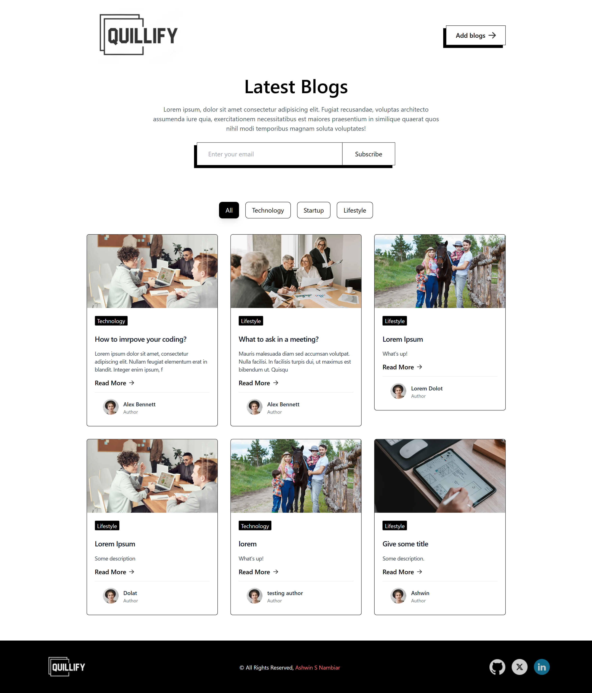

   ### Adding Subscription
   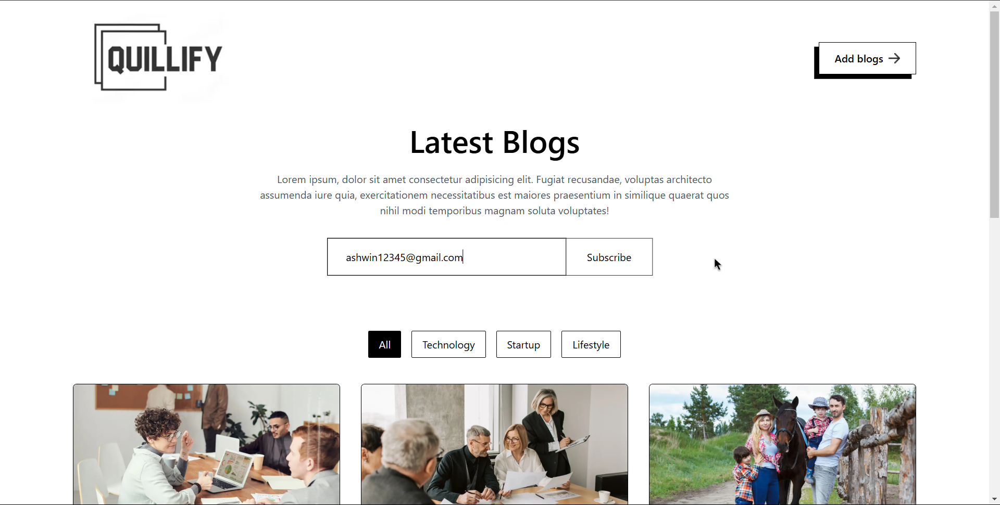

   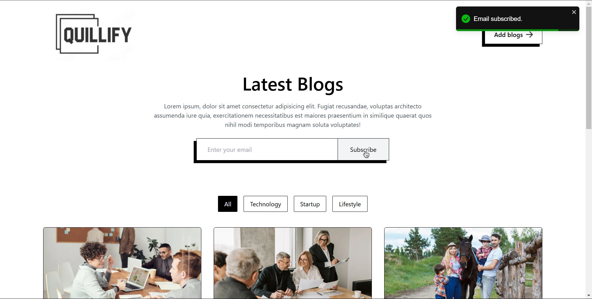

   ### Blog in Detail
   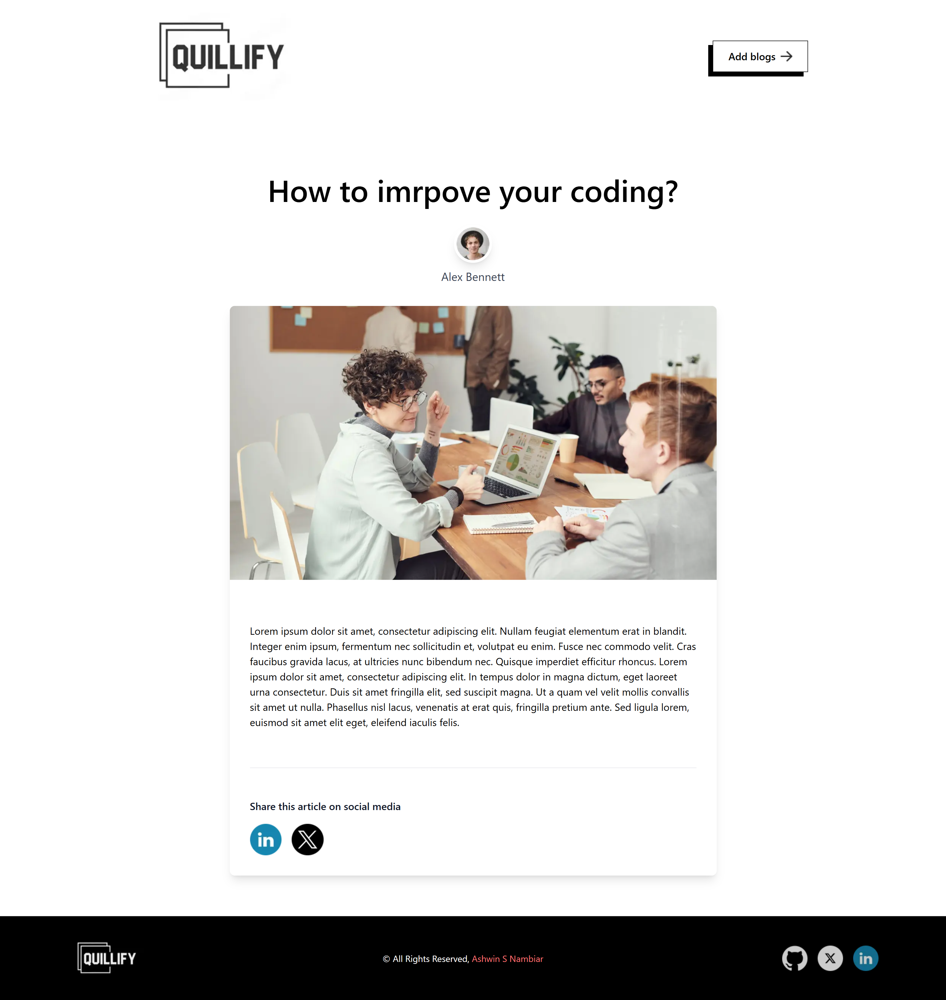

   ### Admin Login
   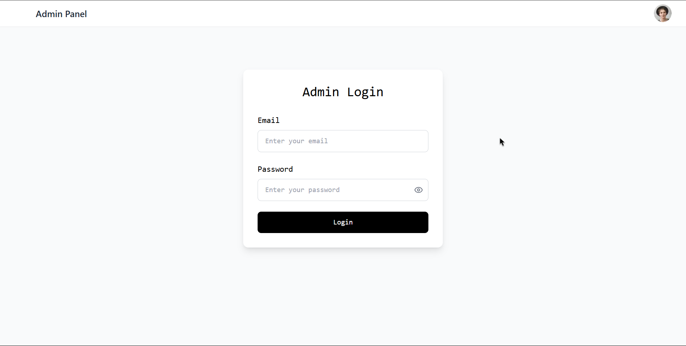

   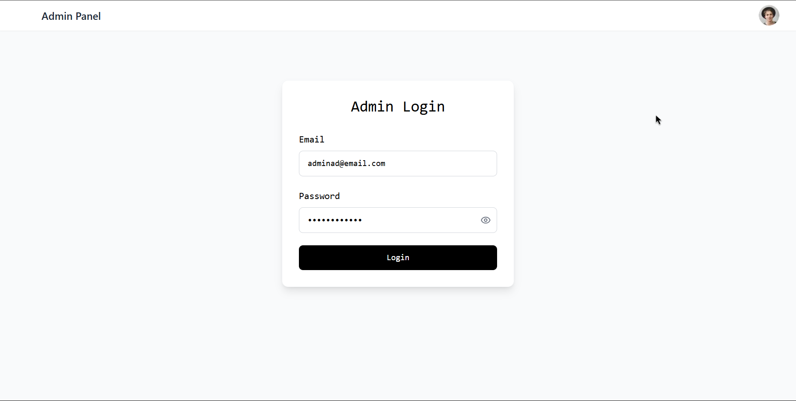

   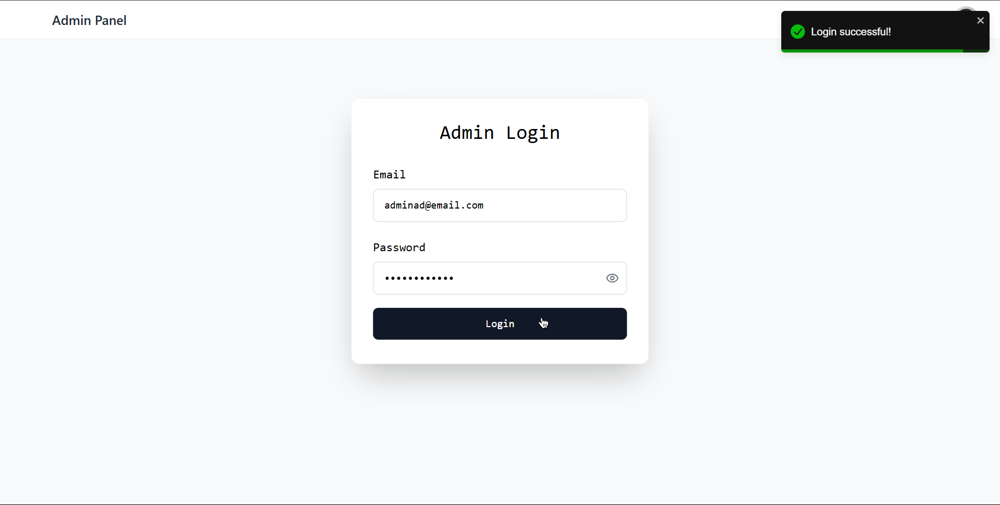

   ### Adding New Blog
   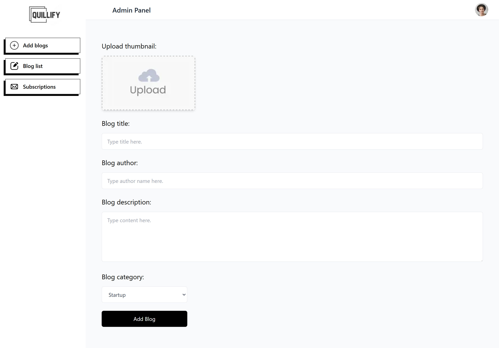
   
   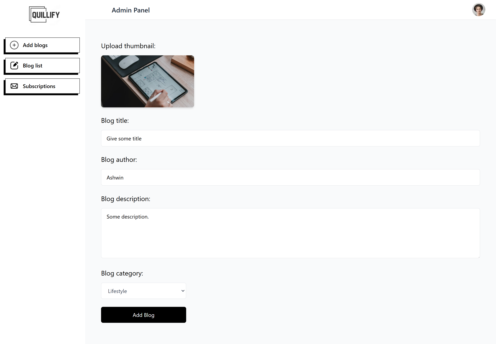

   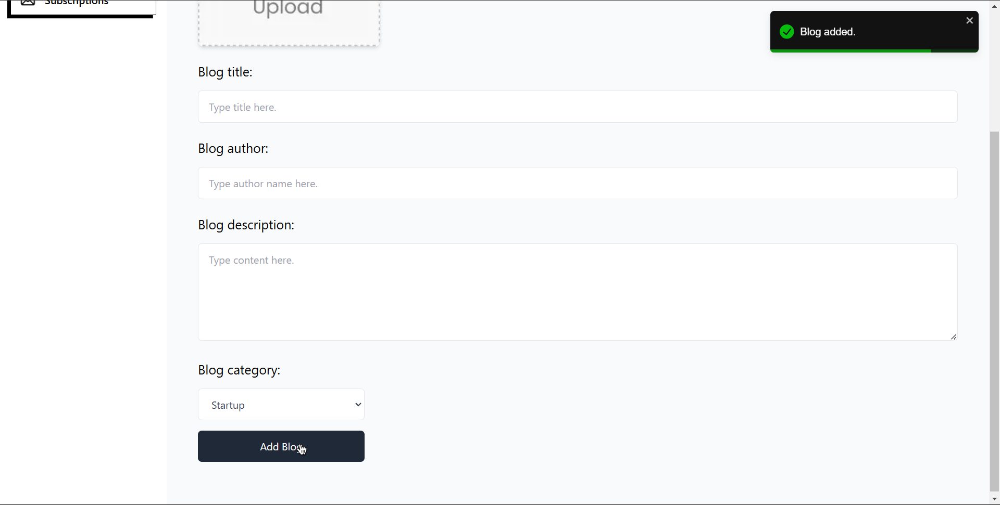

   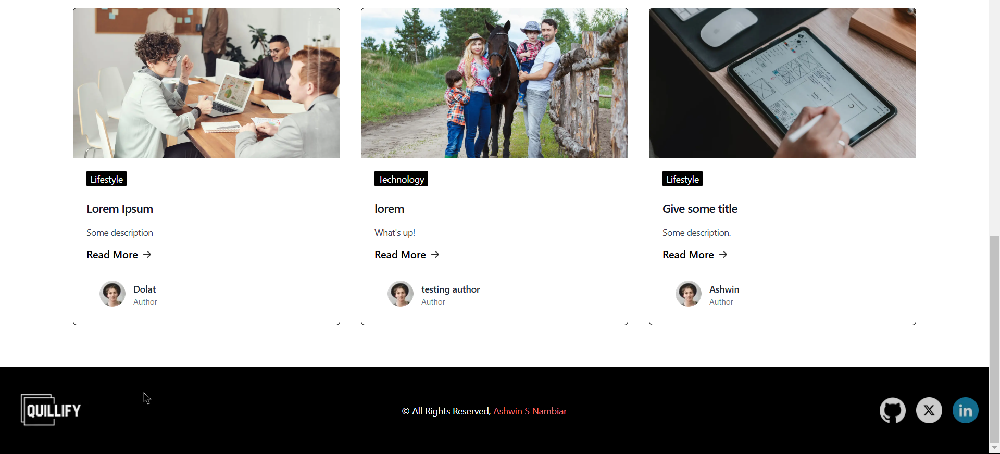

   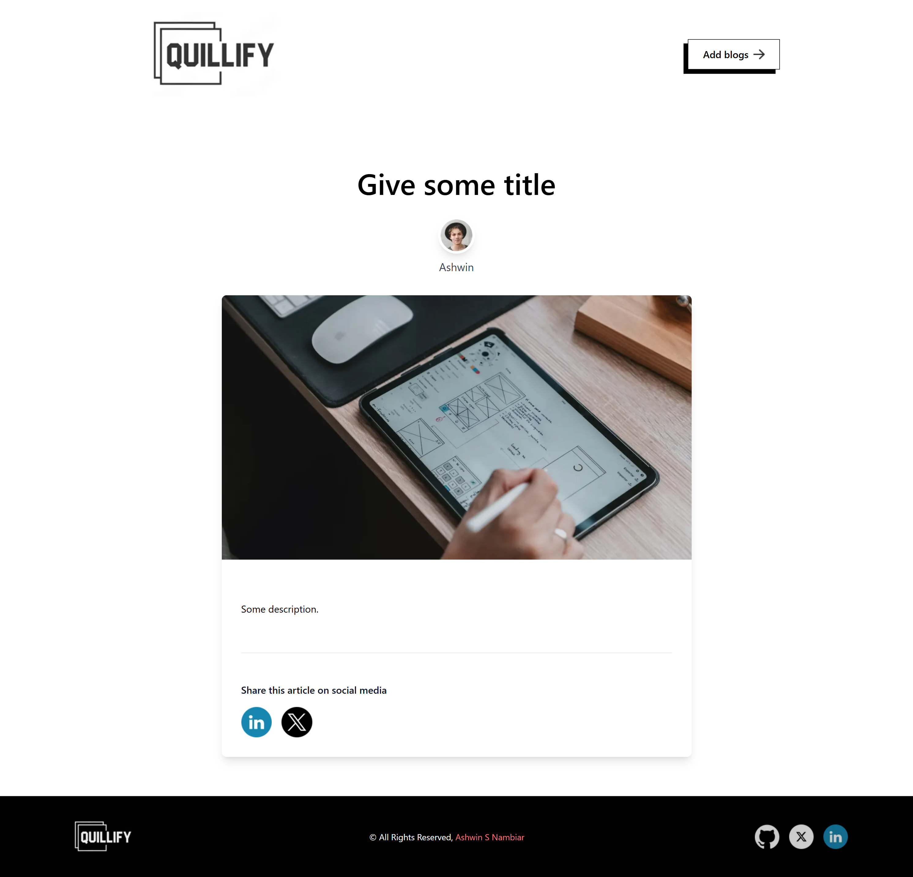

   ### All Blog Details
   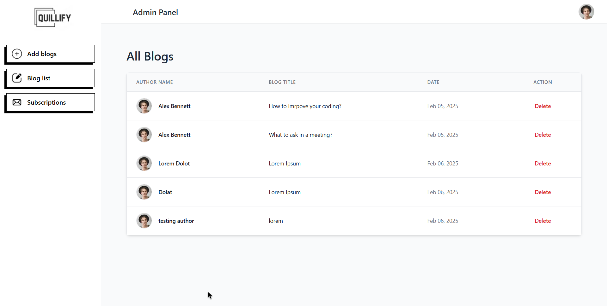

   ### All Subscription Details
   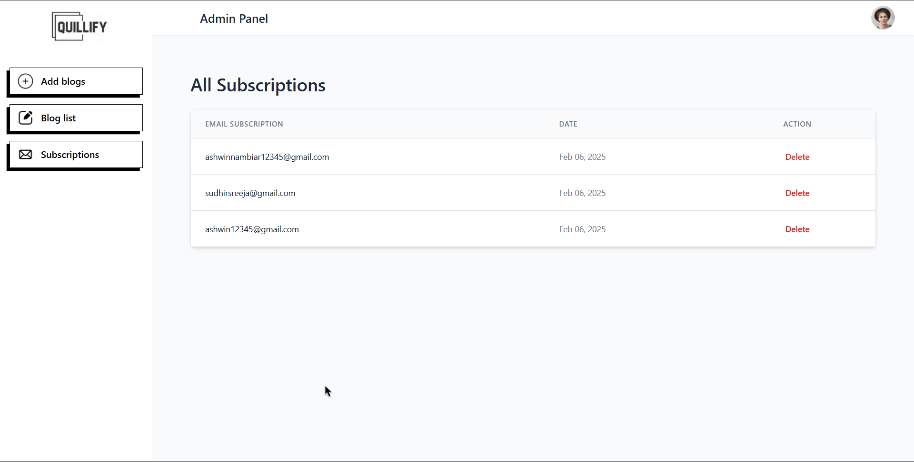

   ### 404 Page
   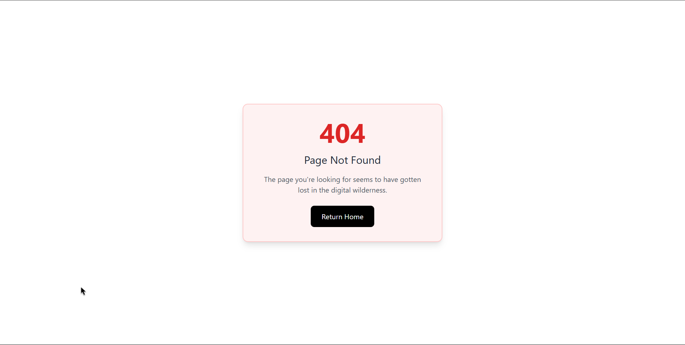

   ### MongoDB Structure
   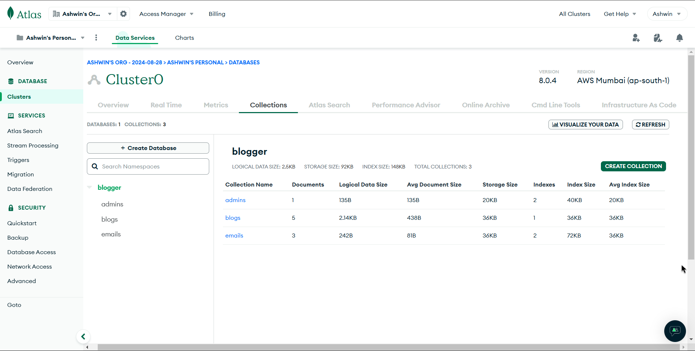

</div>

## 🌐 Live

<div align="center">
   
   [](https://quillify-chi.vercel.app/)

</div>

## 👤 Author

### Ashwin S Nambiar
- Portfolio: [ashwin-s-nambiar.is-a.dev](https://ashwin-s-nambiar.is-a.dev/)
- GitHub: [@Ashwin-S-Nambiar](https://github.com/Ashwin-S-Nambiar)

---

<div align="center">
Made with ❤️ by Ashwin S Nambiar
</div>
